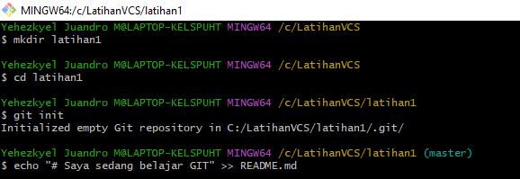

## Step by Step Penggunaan GIT

## Menginstal GIT git.scm

Pertama kalian harus instal terlebih dahulu software [Git Bash](https://git-scm.com/downloads)
Lalu kalian bisa buka software tersebut

## Login Git
Langkah pertama kalian adalah memasukan username dengan menggunakan perintah 

> $ git config --global user.name "UsernameAnda"

lalu kalian tambahkan juga email dengan menggunakan perintah 

> $ git config --global user.email "email anda"

## Login Github

Langkah kedua kalian bisa login ke dalam website github, Setelah kalian login akan muncul tampilan dashboard dari github tersebut

## Buat Repository

Setelah berhasil login ke GitHub, Anda bisa mulai membuat repository. Klik tombol New pada menu Repositories untuk membuat repository baru.

Kemudian kaliam akan diarahkan pada halaman untuk membuat repository baru seperti gambar di bawah ini.

## Buat Folder 

Lalu kalian buat folder di localdisk komputer kalian 

jika sudah kalian klik kanan pada folder tersebut lalu klik Git Bash

Buat folder dengan menggunakan perintah dan buka folder tersebut

> $mkdir latihan1
>
> $cd latihan1
>
> $git init

dan tambahkan file README.md dengan menggunakan perintah 

> $echo " #Saya sedang belajar GIT" >> README.md

jika anda ingin melihat status ketikan anda sudah berhasil atau belum gunakan perintah

> $git status

Untuk menyimpan perubahan yang ada kedalam database repository local, gunakan perintah

> $git commit -m "File Pertama Saya"

Setelah itu menambahkan remote repository. remote Repository merupakan repository server yang akan digunakan untuk menyimpan setiap perubahan pada local repository,
sehingga dapat diakses oleh banyak user. dengan menggunakan perintah

> $git remote add origin [url]

## Mengirim Perubahan Ke Server

Untuk mengirim perubahan pada local repository ke server gunakan perintah git push

> $git push -u origin master

Dan kita bisa cek di repository langsung pada website github

